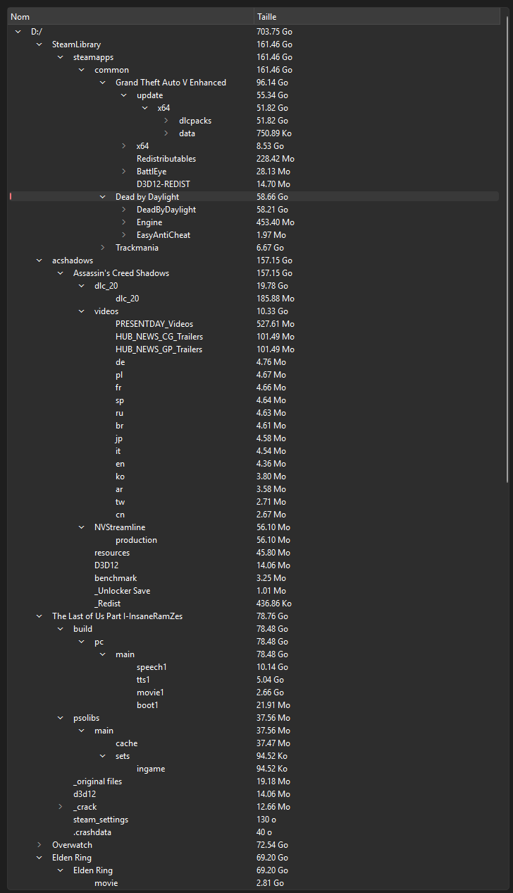
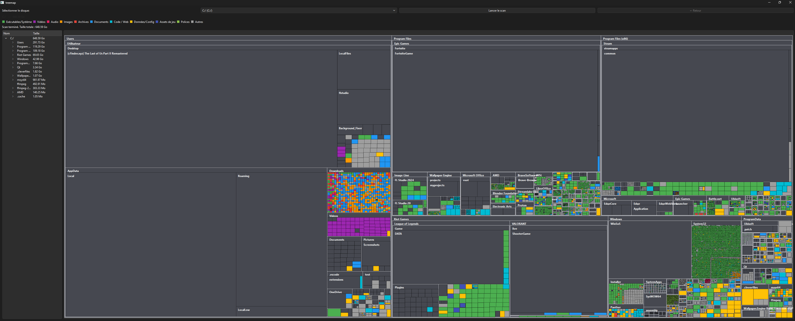
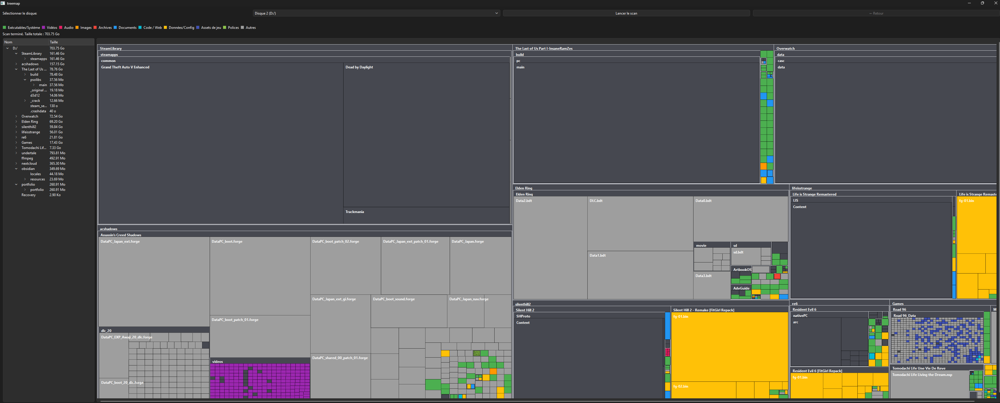

# Treemap

Une petite application Windows (Qt6 / C++17) qui scanne un disque et affiche l'espace utilisé sous forme de **treemap** : chaque dossier et fichier est représenté par un rectangle dont l'aire est proportionnelle à sa taille, façon WinDirStat.

## Aperçu

- Sélection du disque à scanner, scan en arrière-plan (l'interface ne freeze pas).
- Treemap coloré par type de fichier (exécutables, vidéos, images, code, archives...).
- Panneau arborescence à gauche, synchronisé avec le treemap, avec la taille de chaque dossier.
- Navigation par clic : zoomer dans un dossier, bouton Retour, ou clic direct dans l'arborescence.
- Info-bulle au survol (chemin complet, taille, % du dossier parent).
- Clic droit → afficher l'élément dans l'explorateur Windows.

## Captures d'écran

**Arborescence synchronisée avec le treemap** - le panneau de gauche liste tous les dossiers (avec leur taille), déplié ici jusqu'à `SteamLibrary > steamapps > common > Grand Theft Auto V Enhanced > update > x64`. Cliquer un dossier dans l'arbre zoome directement dessus dans le treemap, sans avoir à cliquer niveau par niveau.



**Scan complet d'un disque système (`C:\`, 648 Go)** - le cas le plus difficile à gérer : des centaines de milliers de fichiers, des dossiers Windows énormes et plats (`WinSxS`, `System32`, en vert car remplis de `.dll`/`.exe`), et un dossier `Downloads` en confettis multicolores qui montre bien la variété des types de fichiers d'un usage réel. C'est ce scan qui a servi à débusquer le crash par stack overflow dans l'algorithme de layout.



**Navigation imbriquée sur un disque de jeux (`D:\`, 703 Go)** - plusieurs niveaux de dossiers visibles en même temps (limite fixée à 3 niveaux de subdivision), et le code couleur en action : la vidéo de présentation d'Assassin's Creed Shadows ressort en violet, le gros fichier `fg-01.bin` de Silent Hill 2 Remake en orange (catégorie "Données/Config").



## Fonctionnement / architecture

Le projet est découpé en quatre briques indépendantes :

### `FileNode` (`filenode.h`)

La structure de données de base : un nœud représente un fichier ou un dossier. Un dossier a des enfants (`std::vector<std::unique_ptr<FileNode>>`), un fichier n'en a pas. On ne stocke **pas** le chemin complet dans chaque nœud (seulement le nom) - pour un scan de plusieurs millions de fichiers ça doublerait inutilement la mémoire utilisée. Le chemin complet se reconstruit à la demande en remontant le pointeur `parent`.

### `Scanner` (`scanner.h` / `scanner.cpp`)

Parcourt le disque récursivement avec `std::filesystem` et construit l'arbre de `FileNode`. Quelques points d'attention gérés :

- **Dossiers système exclus** (`$Recycle.Bin`, `System Volume Information`, `pagefile.sys`, `WinSxS`...) - inutiles à afficher et souvent inaccessibles.
- **Détection des jonctions/reparse points Windows** (`FILE_ATTRIBUTE_REPARSE_POINT`) en plus des liens symboliques classiques, pour éviter les boucles infinies (ex : jonctions OneDrive ou `C:\Documents and Settings`).
- **Limite de profondeur** (256) en filet de sécurité contre un cycle de dossiers qui aurait échappé à la détection précédente.
- **Isolation des erreurs par entrée** : si un seul fichier pose problème (nom Unicode non convertible, fichier supprimé pendant l'énumération...), seule cette entrée est ignorée - le reste du dossier continue d'être scanné normalement.
- Le scan tourne dans un thread séparé (`QtConcurrent::run`), avec un callback de progression renvoyé sur le thread principal via `QMetaObject::invokeMethod`.

### `TreeMapLayout` (`treemaplayout.h` / `treemaplayout.cpp`)

Le cœur algorithmique : transforme l'arbre de `FileNode` en rectangles. C'est une implémentation de l'algorithme **squarified treemap** (Bruls, Huizing, van Wijk) : à chaque niveau, les enfants sont regroupés en rangées de façon à garder des rectangles aussi proches du carré que possible (plutôt que des bandes fines illisibles).

Deux choix d'implémentation notables :

- **Itératif, pas récursif.** Un dossier peut contenir des milliers de fichiers (cache navigateur, dossier d'installation...) ; une version récursive classique empile une frame par élément traité et peut faire planter le programme (stack overflow) sur ce genre de dossier. La boucle `while` évite complètement ce problème.
- **Taille minimum garantie** (`computeLayoutWeights`) : sans ça, un petit fichier à côté d'un dossier énorme devient invisible (aire proportionnelle à zéro pixel). Chaque élément reçoit une aire minimale, les plus gros éléments cédant un peu de place en échange.

Chaque dossier réserve aussi une petite marge et un bandeau d'en-tête pour afficher son nom, ce qui le distingue visuellement de son contenu.

### `MainWindow` (`mainwindow.h` / `mainwindow.cpp`)

L'interface Qt Widgets :

- Barre du haut : choix du disque, bouton de scan, bouton Retour, barre de progression.
- `QSplitter` horizontal : `QTreeWidget` (arborescence des dossiers) à gauche, `QGraphicsView`/`QGraphicsScene` (le treemap) à droite.
- Le layout est toujours calculé dans un repère logique fixe (1600×900), puis `QGraphicsView::fitInView()` étire l'affichage pour remplir la fenêtre réelle - évite tout décalage si la fenêtre est redimensionnée après le premier rendu.
- **Profondeur de rendu limitée** (3 niveaux) : au-delà, un dossier s'affiche comme un bloc plein (comme un fichier) plutôt que d'être subdivisé à l'infini, pour garder un affichage lisible. Un clic dessus (ou un clic dans l'arborescence) permet quand même de zoomer dedans.
- Navigation : un clic gauche sur un dossier dans le treemap ou l'arborescence en fait la nouvelle racine affichée (`currentRoot`) ; le bouton Retour remonte simplement d'un niveau via le pointeur `parent` du `FileNode` (pas besoin de pile de navigation).
- Couleurs par extension de fichier, avec une légende affichée sous la barre d'outils.

## Compilation

Projet CMake (`CMakeLists.txt`), nécessite Qt6 (composant `Widgets`) et un compilateur C++17.

```bash
cmake -B build -S .
cmake --build build
```

Testé avec Qt 6.11.1 / MinGW 64-bit sur Windows.

## Limites connues

- Windows uniquement pour l'instant (les détections de jonctions/reparse points utilisent l'API Win32).
- Pas d'annulation possible une fois un scan lancé.

## Licence

MIT - voir [LICENSE](LICENSE).
